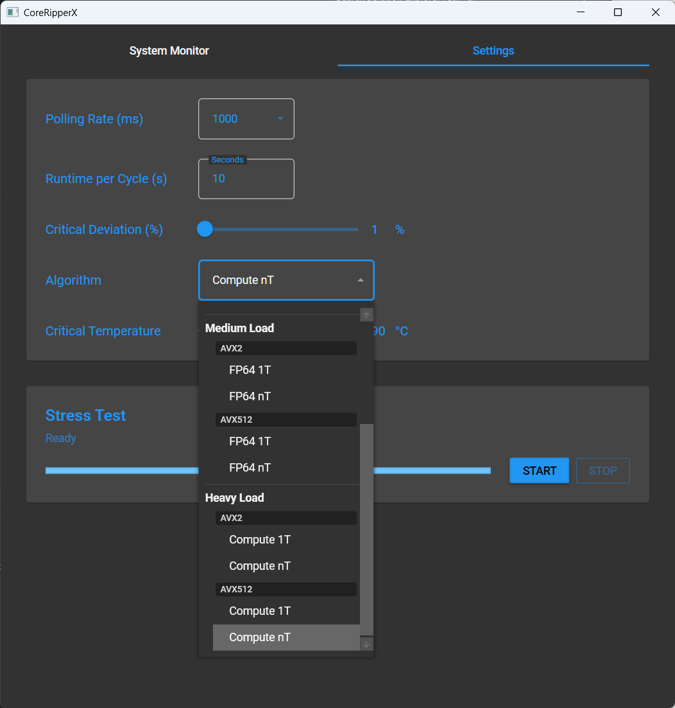

# CoreRipperX

A CPU stress-testing tool for evaluating core performance and stability using AVX2/AVX-512 operations.

## Overview

CoreRipperX evaluates CPU stability and performance by placing heavy computational loads on individual cores or all cores simultaneously. It uses SIMD vector instructions (AVX2 and AVX-512) to stress-test the floating-point and integer execution units, helping identify unstable cores or overclocking issues.

Version 2.0 introduces a WPF desktop application with real-time hardware monitoring.

## Features

- **Multiple Stress Test Algorithms**: Choose from AVX2 or AVX-512 workloads with varying intensity levels
- **Single-Thread (1T) and Multi-Thread (nT) Modes**: Test cores individually or all at once
- **Real-Time Hardware Monitoring**: View CPU temperatures, power consumption, clock speeds, and per-core metrics
- **Error Detection**: Validates computation results to detect CPU instability
- **Hybrid CPU Support**: Correctly handles Intel/AMD processors with different core types

## Requirements

- **Operating System**: Windows (WPF UI requires Windows)
- **CPU**: Processor with AVX2 support (AVX-512 optional for additional algorithms)
- **Runtime**: [.NET 8](https://dotnet.microsoft.com/en-us/download/dotnet/8.0)
- **Privileges**: Administrator rights required for hardware monitoring

## Installation

1. Download the latest release from the [CoreRipperX GitHub releases](https://github.com/CXWorld/CoreRipperX/releases)
2. Extract the archive to your desired location
3. Run `CoreRipperX.UI.exe`

## Stress Test Algorithms

CoreRipperX provides stress test algorithms in both single-thread (1T) and multi-thread (nT) variants:

### Light Load (Mixed)

| Algorithm | Description |
|-----------|-------------|
| **AVX2 Mixed 1T/nT** | Cycles through multiple workload phases: FMA compute, memory+compute, mixed integer/float operations, and shuffle/permute. Exercises different CPU execution units for comprehensive testing with lower sustained power. |
| **AVX512 Mixed 1T/nT** | Same multi-phase approach using 512-bit vectors. Broader coverage of CPU subsystems. Requires AVX-512 capable CPU. |

### Medium Load (FP64)

| Algorithm | Description |
|-----------|-------------|
| **AVX2 FP64 1T/nT** | Double-precision (64-bit) floating-point FMA operations using 256-bit vectors. 8 independent computation chains to saturate FMA units. Moderate power consumption. |
| **AVX512 FP64 1T/nT** | Double-precision FMA using 512-bit vectors. 12 independent chains for maximum FP64 throughput. Requires AVX-512 capable CPU. |

### Heavy Load (Compute)

| Algorithm | Description |
|-----------|-------------|
| **AVX2 Compute 1T/nT** | Single-precision (32-bit) FMA-intensive workload using 256-bit vectors. 16 independent computation chains maximize FMA unit utilization. High power consumption. |
| **AVX512 Compute 1T/nT** | Single-precision FMA using 512-bit vectors. 24 independent chains for extreme compute density. Maximum power draw. Requires AVX-512 capable CPU. |

### Thread Modes

- **1T (Single-Thread)**: Tests each core sequentially for the configured duration before moving to the next core. Useful for identifying specific unstable cores.
- **nT (Multi-Thread)**: Stresses all cores simultaneously. Best for testing overall system stability under full load.

---

## User Guide

### System Monitor Tab

The System Monitor tab displays real-time CPU information:

**Header Section**
- **CPU**: Processor model name
- **Physical Cores**: Number of physical CPU cores
- **Logical Cores**: Total thread count (including SMT/Hyper-Threading)
- **Power**: Current CPU package power consumption in watts
- **Temp**: Current CPU temperature

**Per-Core Table**
- **Core**: Physical core identifier
- **Clock (MHz)**: Current core clock speed
- **Eff. 1T (MHz)**: Effective clock under single-thread load
- **Eff. 2T (MHz)**: Effective clock under dual-thread load (SMT)
- **Deviation %**: Performance deviation from expected (highlighted in red when high - may indicate instability)
- **Load 1T/2T %**: Current load percentage per hardware thread

**Error Counter**: Displays the number of computation errors detected during stress testing. Any non-zero value indicates potential CPU instability.

### Settings Tab

Configure stress test parameters before starting:

**Monitoring Settings**
- **Polling Rate (ms)**: How frequently to update sensor readings (default: 1000ms)
- **Critical Deviation (%)**: Threshold for flagging core performance deviation
- **Critical Temperature (°C)**: Temperature threshold for warnings

**Stress Test Settings**
- **Runtime per Cycle (s)**: Duration to stress each core in 1T mode, or total test duration in nT mode
- **Algorithm**: Select the stress test workload (see Stress Test Algorithms above)

**Controls**
- **START**: Begin the stress test with current settings
- **STOP**: Cancel the running stress test

### Running a Stress Test

1. Open the **Settings** tab
2. Select an algorithm appropriate for your testing goals:
   - Use **Mixed** algorithms for varied workloads that exercise different CPU subsystems
   - Use **FP64** algorithms for moderate stress with lower temperatures
   - Use **Compute** algorithms for maximum stress and power draw
   - Use **1T** variants to identify specific problematic cores
   - Use **nT** variants for full-system stability testing
3. Set the **Runtime per Cycle** (10-60 seconds recommended for 1T mode)
4. Click **START** to begin testing
5. Switch to **System Monitor** to observe temperatures, clocks, and error counts
6. Click **STOP** to end the test early if needed

### Interpreting Results

- **Errors > 0**: Computation validation failed, indicating CPU instability. Consider lowering overclock settings or increasing voltage.
- **High Deviation %**: Core performance is inconsistent, which may indicate thermal throttling or instability.
- **Temperature warnings**: If temperatures approach critical levels, the CPU may throttle or become unstable.

---

## Notes

- Save all work before running stress tests, as system instability may cause crashes
- Monitor temperatures closely, especially with Compute/nT algorithms
- AVX-512 algorithms are only available on supported CPUs (Intel Ice Lake+, AMD Zen 4+)
- Hardware monitoring requires administrator privileges for full sensor access

## License

CoreRipperX is licensed under the MIT License. See the `LICENSE` file for details.

## Contact

For issues, questions, or suggestions, please open an issue on the [GitHub repository](https://github.com/CXWorld/CoreRipperX/issues).
